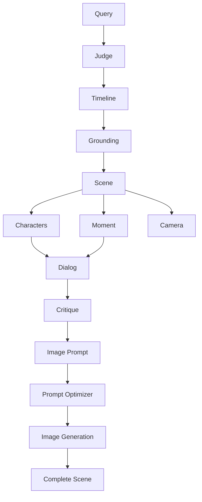

## Welcome to TIMEPOINT Flash API

TIMEPOINT Flash is an AI-powered temporal simulation system that generates historically accurate scenes with characters, dialog, and imagery. The API provides programmatic access to the 14-agent generation pipeline.

## Base URL

```
http://localhost:8000
```

For production deployments, replace with your hosted URL.

## Interactive Documentation

TIMEPOINT Flash includes auto-generated interactive API documentation:

- **Swagger UI**: [http://localhost:8000/docs](http://localhost:8000/docs) - Try endpoints directly in your browser
- **ReDoc**: [http://localhost:8000/redoc](http://localhost:8000/redoc) - Clean, searchable reference
- **OpenAPI Schema**: [http://localhost:8000/openapi.json](http://localhost:8000/openapi.json) - For code generation tools

## Quick Example

Generate a historical scene with streaming progress updates:

```bash
curl -X POST http://localhost:8000/api/v1/timepoints/generate/stream \
  -H "Content-Type: application/json" \
  -d '{
    "query": "Oppenheimer Trinity test control bunker 5:29 AM July 16 1945",
    "preset": "hyper",
    "generate_image": true
  }'
```

<Tip>
The streaming endpoint (`/generate/stream`) is recommended for production use as it provides real-time progress updates via Server-Sent Events.
</Tip>

## Endpoint Categories

| Category | Endpoints | Description |
|----------|-----------|-------------|
| **Authentication** | `/api/v1/auth/*` | Apple Sign-In, JWT tokens, user profile |
| **Credits** | `/api/v1/credits/*` | Balance, transaction history, costs |
| **Generation** | `/api/v1/timepoints/generate/*` | Create historical scenes (stream/sync/async) |
| **Timepoints** | `/api/v1/timepoints/*` | Retrieve and manage generated scenes |
| **Interactions** | `/api/v1/interactions/*` | Chat with characters, extend dialog |
| **Time Travel** | `/api/v1/temporal/*` | Jump forward/backward in time |
| **Models** | `/api/v1/models/*` | List available AI models and providers |
| **Evaluation** | `/api/v1/eval/*` | Compare model latencies |
| **Users** | `/api/v1/users/*` | User timepoints, data export |
| **Health** | `/health` | System health check |

## Quality Presets

Control the speed/quality tradeoff when generating scenes:

| Preset | Speed | Quality | Text Model | Use Case |
|--------|-------|---------|------------|----------|
| `hyper` | ~55s | Good | `google/gemini-2.0-flash-001` | Fast prototyping |
| `balanced` | ~90-110s | Better | `gemini-2.5-flash` | Default (recommended) |
| `hd` | ~120-150s | Best | `gemini-2.5-flash` (extended thinking) | Publication-quality |
| `gemini3` | ~60s | Excellent | `google/gemini-3-flash-preview` | Latest model |

```json Example Request
{
  "query": "Turing interrogation Wilmslow February 1952",
  "preset": "balanced",
  "generate_image": true
}
```

<Note>
You can override preset models with `text_model` and `image_model` parameters for custom configurations.
</Note>

## The Generation Pipeline

TIMEPOINT uses 14 specialized AI agents that run in parallel where possible:



**Key Features:**
- **Grounding Agent**: Verifies facts via Google Search before generation
- **Critique Agent**: Reviews dialog for anachronisms and cultural errors, retries if needed
- **Parallel Execution**: Independent agents run concurrently (~40% faster)
- **3-Tier Image Fallback**: Google Imagen → OpenRouter Flux → Pollinations.ai

## Response Format

All endpoints return JSON. Successful responses include the requested data, while errors follow this format:

```json Error Response
{
  "error": "Error message",
  "detail": "Additional context (only in debug mode)"
}
```

## Status Codes

| Code | Meaning |
|------|------|
| `200` | Success |
| `400` | Bad request - invalid parameters |
| `401` | Unauthorized - missing/invalid JWT |
| `402` | Payment required - insufficient credits |
| `403` | Forbidden - access denied |
| `404` | Not found |
| `422` | Validation error |
| `429` | Rate limit exceeded |
| `500` | Internal server error |

## Health Check

Verify the API is running and check provider status:

```bash
curl http://localhost:8000/health
```

```json Response
{
  "status": "healthy",
  "version": "2.4.0",
  "database": true,
  "providers": {
    "google": true,
    "openrouter": true
  }
}
```

## Next Steps

<CardGroup cols={2}>
  <Card title="Authentication" icon="lock" href="/api/authentication">
    Learn about JWT and service key authentication
  </Card>
  <Card title="Rate Limits" icon="gauge" href="/api/rate-limits">
    Understand rate limiting and best practices
  </Card>
  <Card title="Generation Endpoints" icon="wand-magic-sparkles" href="/api/endpoints/generation">
    Start generating historical scenes
  </Card>
  <Card title="Interactive Docs" icon="book-open" href="http://localhost:8000/docs">
    Try the API in your browser
  </Card>
</CardGroup>
