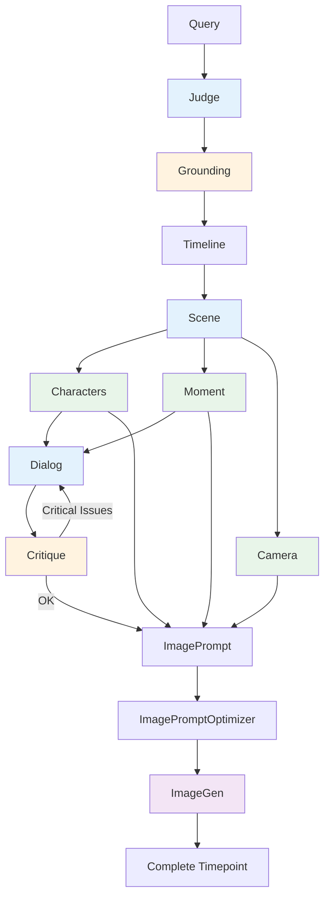

The **Generation Pipeline** (`app/core/pipeline.py:1`) orchestrates the multi-step timepoint creation process using specialized agents. It runs independent steps in parallel while maintaining data flow dependencies.

## Execution Flow

The pipeline runs in **three phases**: sequential foundation → parallel analysis → sequential completion.

<Steps>
  <Step title="Sequential Phase 1: Foundation">
    These steps must run in order because each depends on the previous:
    - **Judge** → Validate query and extract metadata
    - **Grounding** → Verify facts via Google Search (optional, for historical queries)
    - **Timeline** → Extract temporal coordinates
    - **Scene** → Generate environment details
  </Step>
  
  <Step title="Parallel Phase: Analysis">
    Independent steps run simultaneously:
    - **Characters** → Identify people + generate relationships (Graph) + create bios
    - **Moment** → Determine dramatic tension
    - **Camera** → Plan visual composition
    
    These can run in parallel because they all depend only on Phase 1 data (Scene, Timeline) but not on each other.
  </Step>
  
  <Step title="Sequential Phase 2: Completion">
    These steps need data from the parallel phase:
    - **Dialog** → Generate lines (needs Graph for relationships + Moment for tension)
    - **Critique** → Review for errors (retries Dialog once if critical issues found)
    - **ImagePrompt** → Assemble detailed prompt using ALL data
    - **ImagePromptOptimizer** → Compress and physicalize emotion
    - **ImageGen** → Generate the image
  </Step>
</Steps>

## Pipeline Diagram



<Info>
**Blue boxes** = Sequential steps
**Green boxes** = Parallel execution
**Orange boxes** = Optional/conditional
**Purple boxes** = Image generation
</Info>

## Parallel Execution Modes

The pipeline supports **four parallelism modes** based on quality preset and model tier:

<AccordionGroup>
<Accordion title="SEQUENTIAL Mode" icon="1">
**1 call at a time** — Safest mode for debugging or severe rate limits.

- Used for: FREE tier models with strict rate limits
- Parallelism: `1` concurrent call
- Speed: Slowest (~3-4 minutes per timepoint)
- Reliability: Highest (no rate limit errors)

```python
from app.config import ParallelismMode

pipeline = GenerationPipeline(max_parallelism=1)
# Or via preset:
pipeline = GenerationPipeline(preset=QualityPreset.BALANCED)
```
</Accordion>

<Accordion title="NORMAL Mode" icon="2">
**Tier-based default** — 1-3 concurrent calls depending on model tier.

- Used for: HD and BALANCED presets
- Parallelism: `1-3` concurrent (tier-dependent)
- Speed: Moderate (~90-120 seconds)
- Reliability: High

**Execution flow:**
- Sequential: Judge → Timeline → Scene → Characters (with Graph)
- Parallel: Moment + Camera
- Sequential: Dialog → Critique → ImagePrompt → ImageGen

```python
pipeline = GenerationPipeline(preset=QualityPreset.BALANCED)
# Uses NORMAL mode: 3 concurrent calls for NATIVE tier
```
</Accordion>

<Accordion title="AGGRESSIVE Mode" icon="3">
**Higher parallelism** — 2-5 concurrent calls with optimized flow.

- Used for: GEMINI3 preset (thinking model)
- Parallelism: `2-5` concurrent (tier-dependent)
- Speed: Fast (~60-90 seconds)
- Reliability: Good

**Optimized execution flow:**
- Sequential: Judge → Timeline → Scene
- Parallel: **Camera starts immediately** (only needs Scene data)
- Characters: CharacterID → then Graph + Moment + Bios **all in parallel**
- Sequential: Dialog → Critique → ImagePrompt → ImageGen

```python
pipeline = GenerationPipeline(preset=QualityPreset.GEMINI3)
# Uses AGGRESSIVE mode with optimized flow
```
</Accordion>

<Accordion title="MAX Mode" icon="bolt">
**Maximum parallelism** — Up to 8 concurrent calls (provider limit - 1).

- Used for: HYPER preset (speed focus)
- Parallelism: `2-8` concurrent (tier + provider dependent)
- Speed: Fastest (~45-75 seconds)
- Reliability: Requires stable provider

**Maximum parallelism flow:**
- Same as AGGRESSIVE but with higher concurrent limits
- Google NATIVE tier: up to 8 concurrent
- OpenRouter PAID tier: up to 6 concurrent

```python
pipeline = GenerationPipeline(preset=QualityPreset.HYPER)
# Uses MAX mode: 8 concurrent for Google native
```
</Accordion>
</AccordionGroup>

## Tier-Based Parallelism

The pipeline automatically detects model tier and adjusts parallelism:

| Model Tier | SEQUENTIAL | NORMAL | AGGRESSIVE | MAX |
|------------|------------|--------|------------|-----|
| **FREE** (OpenRouter free models) | 1 | 1 | 2 | 2 |
| **PAID** (OpenRouter paid) | 1 | 3 | 5 | 6 |
| **NATIVE** (Google API key) | 1 | 3 | 5 | 8 |

<Note>
The pipeline uses **semaphore-based concurrency control** to prevent rate limit errors. Each agent call acquires a semaphore slot before execution.
</Note>

## Code Structure

### Pipeline State

The pipeline accumulates data in `PipelineState` as it progresses:

```python
@dataclass
class PipelineState:
    query: str
    judge_result: JudgeResult | None = None
    grounded_context: GroundedContext | None = None  # From Google Search
    timeline_data: TimelineData | None = None
    scene_data: SceneData | None = None
    character_data: CharacterData | None = None
    moment_data: MomentData | None = None
    dialog_data: DialogData | None = None
    camera_data: CameraData | None = None
    graph_data: GraphData | None = None
    image_prompt_data: ImagePromptData | None = None
    optimized_prompt: str | None = None
    image_base64: str | None = None
    step_results: list[StepResult] = field(default_factory=list)
```

**Location:** `app/core/pipeline.py:139`

### Step Execution

Each step follows the same pattern:

```python
async def _step_characters(self, state: PipelineState) -> PipelineState:
    """Execute character generation step."""
    step = PipelineStep.CHARACTERS
    
    # 1. Validate dependencies
    if not state.timeline_data or not state.scene_data:
        state.step_results.append(
            StepResult(step=step, success=False, error="Missing dependencies")
        )
        return state
    
    # 2. Run agent
    result = await self._characters_agent.run(input_data)
    
    # 3. Store result
    if result.success:
        state.character_data = result.content
    
    # 4. Record step result
    state.step_results.append(
        StepResult(
            step=step,
            success=result.success,
            data=state.character_data,
            latency_ms=result.latency_ms,
            model_used=result.model_used,
        )
    )
    
    return state
```

**Location:** `app/core/pipeline.py:1098`

### Parallel Execution with Semaphore

Parallel steps use asyncio.gather with semaphore control:

```python
async def _run_standard_flow(self, state: PipelineState) -> PipelineState:
    """Run standard execution flow (SEQUENTIAL/NORMAL modes)."""
    # Characters step includes Graph generation
    state = await self._step_characters(state)
    
    # Parallel: Moment + Camera
    async def run_with_semaphore(coro):
        async with self._semaphore:
            return await coro
    
    moment_task = run_with_semaphore(self._step_moment(state))
    camera_task = run_with_semaphore(self._step_camera(state))
    
    parallel_results = await asyncio.gather(
        moment_task, camera_task,
        return_exceptions=True
    )
    
    # Merge results back into state
    self._merge_parallel_results(state, parallel_results, ["moment", "camera"])
    return state
```

**Location:** `app/core/pipeline.py:514`

## Error Handling

The pipeline distinguishes between critical and non-critical failures:

### Critical Failures

These **stop the pipeline** immediately:
- Judge validation fails
- Timeline extraction fails
- Scene generation fails
- Character generation fails

### Non-Critical Failures

These **continue with available data**:
- **Grounding fails** → Pipeline continues without verified facts (falls back to LLM knowledge)
- **Image generation fails** → User still gets all text content (scene, characters, dialog)

```python
@property
def has_critical_errors(self) -> bool:
    """Check if any critical step failed."""
    non_critical_steps = {PipelineStep.IMAGE_GENERATION, PipelineStep.GROUNDING}
    return any(
        not r.success and r.step not in non_critical_steps
        for r in self.step_results
    )
```

**Location:** `app/core/pipeline.py:193`

## Streaming Updates

The pipeline supports streaming for real-time progress updates:

```python
async for step, result, state in pipeline.run_streaming(query):
    print(f"{step.value}: {'✓' if result.success else '✗'} ({result.latency_ms}ms)")
    if step == PipelineStep.CHARACTERS:
        print(f"  Found {len(state.character_data.characters)} characters")
```

**Location:** `app/core/pipeline.py:799`

<Warning>
Streaming mode yields results **as they complete** during parallel phases, so Moment and Camera may arrive in any order.
</Warning>

## Performance Optimization

### Optimized Flow (AGGRESSIVE/MAX)

In AGGRESSIVE and MAX modes, the pipeline uses an **optimized flow** that maximizes parallelism:

```python
# Standard flow (NORMAL mode):
Characters (ID + Graph + Bios) → then Moment + Camera in parallel

# Optimized flow (AGGRESSIVE/MAX):
Camera starts immediately after Scene
+ Characters: ID → then Graph + Moment + Bios ALL in parallel
```

**Key optimization:** Moment only needs character **names** (from CharacterID), not full bios, so it can run earlier.

**Location:** `app/core/pipeline.py:543`

### Parallelism Configuration

Each quality preset maps to a parallelism mode:

```python
PRESET_PARALLELISM: dict[QualityPreset, ParallelismMode] = {
    QualityPreset.HD: ParallelismMode.NORMAL,       # Quality focus
    QualityPreset.BALANCED: ParallelismMode.NORMAL, # Default
    QualityPreset.HYPER: ParallelismMode.MAX,       # Speed focus
    QualityPreset.GEMINI3: ParallelismMode.AGGRESSIVE,  # Thinking model
}
```

**Location:** `app/config.py:206`

## Usage Examples

<CodeGroup>
```python Basic Usage
from app.core.pipeline import GenerationPipeline

pipeline = GenerationPipeline()
result = await pipeline.run(
    query="Oppenheimer watches Trinity test, July 16 1945",
    generate_image=True
)

print(f"Year: {result.timeline_data.year}")
print(f"Characters: {len(result.character_data.characters)}")
print(f"Image: {len(result.image_base64)} bytes")
```

```python With Quality Preset
from app.config import QualityPreset

pipeline = GenerationPipeline(preset=QualityPreset.HYPER)
result = await pipeline.run(query, generate_image=True)
# Uses MAX parallelism mode for fastest generation
```

```python With Custom Parallelism
pipeline = GenerationPipeline(max_parallelism=2)
result = await pipeline.run(query)
# Limits to 2 concurrent calls regardless of tier
```

```python Streaming Mode
async for step, result, state in pipeline.run_streaming(query, generate_image=True):
    if result.success:
        print(f"✓ {step.value} completed in {result.latency_ms}ms")
    else:
        print(f"✗ {step.value} failed: {result.error}")
```
</CodeGroup>

## Next Steps

<CardGroup cols={2}>
  <Card title="Agents" icon="robot" href="/concepts/agents">
    Learn about the 15 specialized agents
  </Card>
  <Card title="Quality Presets" icon="sliders" href="/concepts/quality-presets">
    Configure models and parallelism
  </Card>
  <Card title="Grounding" icon="magnifying-glass" href="/concepts/grounding">
    How Google Search verification works
  </Card>
  <Card title="API Reference" icon="code" href="/api-reference/generation/create">
    Use the pipeline via API
  </Card>
</CardGroup>