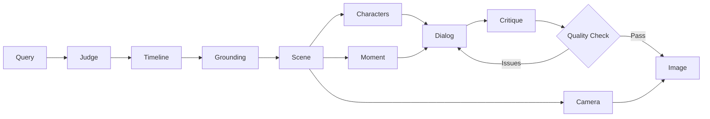

## What is TIMEPOINT Flash?

TIMEPOINT Flash is an AI-powered API service that generates complete historical scenes from natural language queries. Type any moment in history and get characters with distinct voices, period-accurate dialog, relationship dynamics, and a photorealistic image — all verified against Google Search.

<CardGroup cols={2}>
  <Card title="Quick Start" icon="rocket" href="/quickstart">
    Get up and running in minutes with our installation guide
  </Card>
  <Card title="API Reference" icon="code" href="/api/overview">
    Explore the complete REST API documentation
  </Card>
  <Card title="Agent Pipeline" icon="sitemap" href="/concepts/agents">
    Learn about the 15 specialized agents that power generation
  </Card>
  <Card title="Examples" icon="sparkles" href="/features/scene-generation">
    See example scenes from historical moments
  </Card>
</CardGroup>

## Key Features

<CardGroup cols={3}>
  <Card title="14-Agent Pipeline" icon="gears">
    Specialized agents handle each step: Judge, Timeline, Grounding, Scene, Characters, Dialog, Image
  </Card>
  <Card title="Google Search Grounding" icon="magnifying-glass">
    Historical accuracy verified against Google Search for locations, dates, and participants
  </Card>
  <Card title="Voice Differentiation" icon="microphone">
    Characters speak with distinct social registers and verbal patterns
  </Card>
  <Card title="Temporal Navigation" icon="clock">
    Jump forward or backward in time to explore what happens next
  </Card>
  <Card title="3-Tier Image Fallback" icon="image">
    Google Imagen → OpenRouter Flux → Pollinations.ai ensures generation never fails
  </Card>
  <Card title="Quality Presets" icon="sliders">
    Choose speed vs quality: hyper (55s), balanced (90s), or hd (150s)
  </Card>
</CardGroup>

## Example Scene

Generate a scene from any historical moment:

```bash
curl -X POST http://localhost:8000/api/v1/timepoints/generate/stream \
  -H "Content-Type: application/json" \
  -d '{
    "query": "AlphaGo plays Move 37 against Lee Sedol in Game 2, Four Seasons Hotel Seoul March 10 2016",
    "preset": "hyper",
    "generate_image": true
  }'
```

The pipeline produces:
- **Location**: Four Seasons Hotel, Seoul, South Korea
- **Date**: March 10, 2016 — afternoon, spring
- **Characters**: Lee Sedol, AlphaGo (monitor), Commentators, Tournament Official
- **Dialog**: 7 voice-differentiated lines capturing the moment
- **Image**: Photorealistic rendering of the scene

<Note>
All scenes include character bios, relationship graphs, temporal coordinates, camera composition, and grounded historical facts verified via Google Search.
</Note>

## How It Works



The pipeline uses parallel execution where possible, cutting generation time by ~40%. A critique-retry loop ensures dialog quality, checking for anachronisms, cultural errors, and voice distinctiveness.

## Use Cases

<CardGroup cols={2}>
  <Card title="Historical Research" icon="book">
    Explore historical moments with verified facts and context
  </Card>
  <Card title="Education" icon="graduation-cap">
    Create immersive historical scenes for teaching
  </Card>
  <Card title="Content Creation" icon="pen-fancy">
    Generate period-accurate scenes for stories and games
  </Card>
  <Card title="Character AI" icon="comments">
    Chat with historical figures in context
  </Card>
</CardGroup>

## Next Steps

<CardGroup cols={2}>
  <Card title="Installation" icon="download" href="/quickstart">
    Install and configure TIMEPOINT Flash
  </Card>
  <Card title="Core Concepts" icon="lightbulb" href="/concepts/pipeline">
    Understand the generation pipeline
  </Card>
  <Card title="Configuration" icon="gear" href="/configuration/environment">
    Set up environment variables and API keys
  </Card>
  <Card title="Deployment" icon="server" href="/deployment">
    Deploy to production or Replit
  </Card>
</CardGroup>
