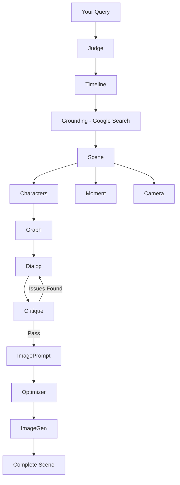

## What is TIMEPOINT Flash?

TIMEPOINT Flash is an AI-powered Reality Writer that renders historically grounded moments from any point in time. Type any moment in history and get a complete scene in 60-120 seconds: characters with distinct voices, period-accurate dialog, relationship dynamics, and a photorealistic image—all verified against Google Search.

<Note>
**Synthetic Time Travel**: Not historical simulation, but experiential rendering. Flash generates what *being there* would have felt like—the tension, the voices, the atmosphere—grounded in verified facts.
</Note>

## Key Features

<CardGroup cols={2}>
  <Card title="Google Search Grounding" icon="magnifying-glass">
    Every scene is verified against real historical data. Not "a room in New York" but "35th floor of the Equitable Center, Manhattan."
  </Card>
  <Card title="Voice Differentiation" icon="message">
    Each character gets a unique social register and speech pattern. Characters must be identifiable by voice alone.
  </Card>
  <Card title="Critique Loop" icon="rotate">
    Dialog is automatically reviewed for anachronisms, cultural errors, and voice distinctiveness. Retries if critical issues are found.
  </Card>
  <Card title="14 Specialized Agents" icon="sitemap">
    Parallel execution pipeline with Judge, Timeline, Grounding, Scene, Characters, Dialog, Critique, Image Generation, and more.
  </Card>
</CardGroup>

## Example Generation

Here's what Flash produces from a single query:

```bash
curl -X POST localhost:8000/api/v1/timepoints/generate/stream \
  -H "Content-Type: application/json" \
  -d '{"query": "AlphaGo plays Move 37 against Lee Sedol in Game 2, Four Seasons Hotel Seoul March 10 2016", "generate_image": true}'
```

**Generated Scene:**

```
Location:    Four Seasons Hotel, Seoul, South Korea
Date:        March 10, 2016 — afternoon, spring
Tension:     high

Setting:     A brightly lit, modern conference room arranged for a Go tournament.
             Central Go board on a low, polished wooden table. Lee Sedol sits
             opposite the AlphaGo system, represented by a monitor displaying its
             moves. Journalists, AI researchers, and Go enthusiasts seated in rows
             behind a low barrier. Cables snake across the floor.

Atmosphere:  Intense concentration and quiet anticipation. The audience is hushed.
             A palpable sense of history being made, mixed with disbelief at
             AlphaGo's unconventional moves.
```

**Characters:**

| Name | Role | Voice |
|------|------|-------|
| **Lee Sedol** | primary | Short, halting fragments — stunned understatement |
| **AlphaGo** | primary, silent | Represented by monitor (non-human entity resolved by grounding agent) |
| **Commentator 1** | secondary | Chatty, analytical, comfortable on-air cadence |
| **Commentator 2** | secondary | More measured, technical observations |
| **Tournament Official** | secondary | Formal, procedural |

**Dialog:**

> **Lee Sedol:** "...Huh. That's... certainly a move."
>
> **Commentator 1:** "Well, that's one way to put it. I'm not sure I've ever seen a professional play quite like that before."
>
> **Lee Sedol:** "It's... unexpected, to say the least. Maybe it's a bluff?"
>
> **Commentator 1:** "A bluff? Against AlphaGo? Now that's a thought."

## How the Agent Pipeline Works

Flash uses 14 specialized agents that run in parallel where possible:



### Pipeline Phases

<Steps>
  <Step title="Validation & Grounding">
    **Judge** validates the query, **Timeline** extracts date/location, and **Grounding** verifies facts via Google Search. This ensures historical accuracy before generation begins.
  </Step>
  
  <Step title="Parallel Generation">
    **Scene**, **Characters**, **Moment**, and **Camera** run simultaneously. Characters are grounded against search results to verify names and physical presence.
  </Step>
  
  <Step title="Dialog & Review">
    **Dialog** generates period-accurate conversation. **Critique** reviews for anachronisms, cultural errors, and voice distinctiveness—retries if critical issues found.
  </Step>
  
  <Step title="Image Generation">
    **ImagePrompt** assembles a detailed prompt with grounded facts. **Optimizer** compresses and translates emotion into physical body language. **ImageGen** creates the image with 3-tier fallback (Google Imagen → OpenRouter Flux → Pollinations.ai).
  </Step>
</Steps>

## Quality Capabilities

### Google Search Grounding

Verified locations, dates, and participants. Not "a room in New York" but "35th floor of the Equitable Center, Manhattan, in a theater-style room with raised seating."

### Critique Loop

Dialog is reviewed for:
- **Anachronisms**: Modern slang in ancient Rome
- **Cultural errors**: Greek vs Roman deities
- **Voice distinctiveness**: Characters sound different from each other
- **Historical accuracy**: Period-appropriate language

Critical issues trigger automatic retry with corrections.

### Voice Differentiation

Each character gets a social register (elite/educated/common/servant/child) that constrains:
- Sentence structure
- Vocabulary choices
- Verbal tics and patterns

Characters must be identifiable by voice alone.

### Emotional Transfer

The image prompt optimizer translates narrative tension into physicalized body language:
- "Climactic tension" → "wide eyes, dropped objects, body recoiling"
- "Quiet determination" → "clenched jaw, steady gaze, forward lean"

Emotion isn't discarded—it's rendered visually.

### Entity Representation

Non-human entities (Deep Blue, AlphaGo, HAL 9000) are shown through their physical representatives:
- **Deep Blue** → IBM operator relaying moves
- **AlphaGo** → Monitor display with operator
- **HAL 9000** → Red camera lens on wall

### 3-Tier Image Fallback

Image generation never fails:
1. **Google Imagen** (gemini-2.5-flash-image) — Fast, 1K resolution
2. **OpenRouter Flux** (black-forest-labs/flux-1.1-pro) — High quality
3. **Pollinations.ai** — Free fallback

## Quality Presets

Flash provides 4 quality presets balancing speed and quality:

| Preset | Speed | Provider | Best For |
|--------|-------|----------|----------|
| **hyper** | ~55s | OpenRouter | Fast iteration, prototyping |
| **balanced** | ~90-110s | Google Native | Production quality (default) |
| **hd** | ~2-2.5 min | Google Native | Maximum fidelity (extended thinking) |
| **gemini3** | ~60s | OpenRouter | Latest model, agentic workflows |

```bash
# Fast prototyping
curl -X POST localhost:8000/api/v1/timepoints/generate/stream \
  -d '{"query": "Kasparov Deep Blue Game 6 Equitable Center 1997", "preset": "hyper"}'

# Production quality
curl -X POST localhost:8000/api/v1/timepoints/generate/stream \
  -d '{"query": "Oppenheimer Trinity test 5:29 AM July 16 1945", "preset": "hd"}'
```

## Interactive Features

Once a scene is generated, you can:

<CardGroup cols={2}>
  <Card title="Chat with Characters" icon="comments">
    Ask any character questions. They respond in-character with period-appropriate knowledge.
  </Card>
  <Card title="Time Travel" icon="clock">
    Jump forward or backward in time. See what happened 1 hour later or 1 day before.
  </Card>
  <Card title="Survey" icon="question">
    Ask all characters the same question and compare their perspectives.
  </Card>
  <Card title="Extend Dialog" icon="message-plus">
    Generate additional lines of conversation in the same scene.
  </Card>
</CardGroup>

```bash
# Chat with a character
POST /api/v1/interactions/{timepoint_id}/chat
{"character_name": "Lee Sedol", "message": "What went through your mind when you saw Move 37?"}

# Jump forward 1 hour
POST /api/v1/temporal/{timepoint_id}/next
{"units": 1, "unit": "hour"}
```

## The Clockchain Connection

Flash is the Reality Writer for the Clockchain—a temporal causal graph that accumulates verified historical anchors. Every scene becomes a grounded data point strengthening the Bayesian prior for future renderings.

**Today**: Flash uses Google Search for grounding  
**Tomorrow**: The Clockchain provides complementary grounding from accumulated validated causal paths

Flash scenes can be exported as TDF (Timepoint Data Format) records for use across the Timepoint suite.

## Use Cases

<CardGroup cols={2}>
  <Card title="Historical Research" icon="book">
    Generate experiential understanding of historical moments with verified facts and period-accurate atmosphere.
  </Card>
  <Card title="Education" icon="graduation-cap">
    Create immersive historical scenes for teaching. Students can chat with historical figures.
  </Card>
  <Card title="Creative Writing" icon="pen">
    Research period-accurate dialog, relationships, and atmosphere for historical fiction.
  </Card>
  <Card title="Training Data" icon="database">
    Generate high-quality synthetic training data with verified historical grounding.
  </Card>
</CardGroup>

## Technical Stack

- **Framework**: FastAPI with async/await
- **AI Models**: Google Gemini (gemini-2.5-flash), OpenRouter (optional)
- **Image Generation**: Google Imagen, Flux, Pollinations.ai (3-tier fallback)
- **Grounding**: Google Search API
- **Database**: SQLAlchemy with SQLite/PostgreSQL
- **Validation**: Pydantic v2
- **Testing**: 660+ tests with pytest

## Open Source

TIMEPOINT Flash is Apache 2.0 licensed. Part of the Timepoint suite of open-source temporal AI engines.

<CardGroup cols={3}>
  <Card title="Flash" icon="bolt" href="https://github.com/timepoint-ai/timepoint-flash">
    Reality Writer (this project)
  </Card>
  <Card title="Pro" icon="wand-magic-sparkles" href="https://github.com/timepoint-ai/timepoint-pro">
    SNAG-powered simulation engine
  </Card>
  <Card title="Clockchain" icon="link" href="https://github.com/timepoint-ai/timepoint-clockchain">
    Temporal causal graph
  </Card>
</CardGroup>

## Next Steps

<CardGroup cols={2}>
  <Card title="Quickstart" icon="rocket" href="/quickstart">
    Get from zero to your first generated scene in 5 minutes
  </Card>
  <Card title="API Reference" icon="code" href="/api-reference">
    Complete endpoint documentation with examples
  </Card>
  <Card title="Deployment" icon="server" href="/deployment">
    Deploy locally, on Replit, or to production
  </Card>
  <Card title="Architecture" icon="diagram-project" href="/architecture">
    Deep dive into the 14-agent pipeline
  </Card>
</CardGroup>